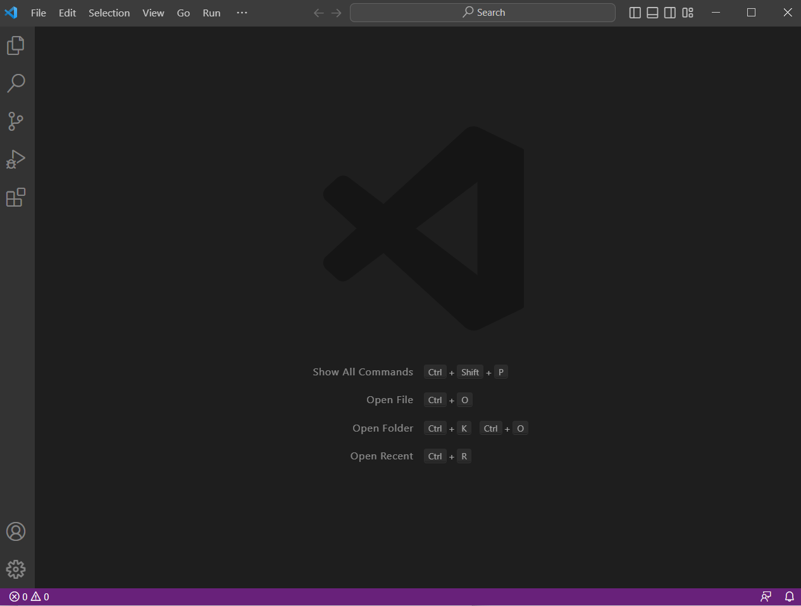
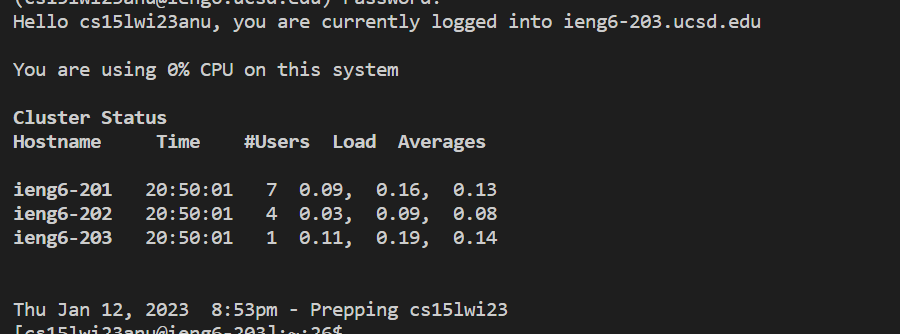

# Lab 1 Report

## 1. Installing VS Code

To install VS Code, go to [the VS code website](https://code.visualstudio.com/) and follow their 
instructions for your particular system. Just run the installer and follow its directions.

Once it is installed, it should look like: 

## 2. Remotely Connecting

First, make sure you have your account set up with your username and password. 

If you are on a windows machine, you will also have to install Git from the [Git website](https://gitforwindows.org/).

Now, you should be able to use the `git bash` terminal 

In the new terminal, we can `ssh` into our account using the command:
```
ssh cs15lwi23zzz@ieng6.ucsd.edu
```
where zzz is replaced by your unique 3 letters
from your account.

If its your first time using this command to log
into your account, you will get a message like:
```
The authenticity of host 'ieng6.ucsd.edu (128.54.70.227)' can't be established.
RSA key fingerprint is SHA256:ksruYwhnYH+sySHnHAtLUHngrPEyZTDl/1x99wUQcec.
Are you sure you want to continue connecting (yes/no/[fingerprint])? 
```

If its your first time getting this message, respond with yes as it will allow you to log in.

Then you will be prompted to input your password. You wont be able to see your password as you are typing it, but trust that it is reading your key presses. 

Once you are logged in, your terminal should look like this:


## 3. Trying Some Commands

